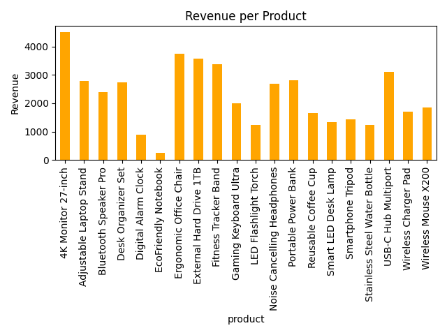

## 📊 Sales Summary from Database

This project demonstrates how to use **Python** and **SQLite** together to extract and visualize basic sales data using SQL queries, `pandas`, and `matplotlib`.

---

### 📝 Task Objective

> Connect to a SQLite database, run SQL queries to calculate total quantity sold and revenue per product, and visualize the result using a bar chart.

---

### 🛠️ Tools & Technologies

* Python
* SQLite (`sqlite3`)
* Pandas
* Matplotlib
* Jupyter Notebook (`.ipynb`)

---

### 📂 Files in This Repo

| File Name            | Description                                    |
| -------------------- | ---------------------------------------------- |
| `Sale_Summary.ipynb` | Jupyter Notebook with complete code            |
| `sales_data.db`      | SQLite database file with a sample sales table |
| `sales_chart.png`    | Bar chart showing revenue per product          |

---

### 🔍 Key Steps Performed

1. **Connected to SQLite database** using `sqlite3`.
2. **Executed SQL query** to group sales by product and calculate:

   * Total Quantity Sold
   * Total Revenue (`quantity * price`)
3. **Loaded result into Pandas DataFrame**.
4. **Displayed summary table and created bar chart** using `matplotlib`.
5. **Saved the bar chart** as `sales_chart.png`.

---

### 📈 Output Preview

Bar chart of revenue generated per product (saved as `sales_chart.png`).

